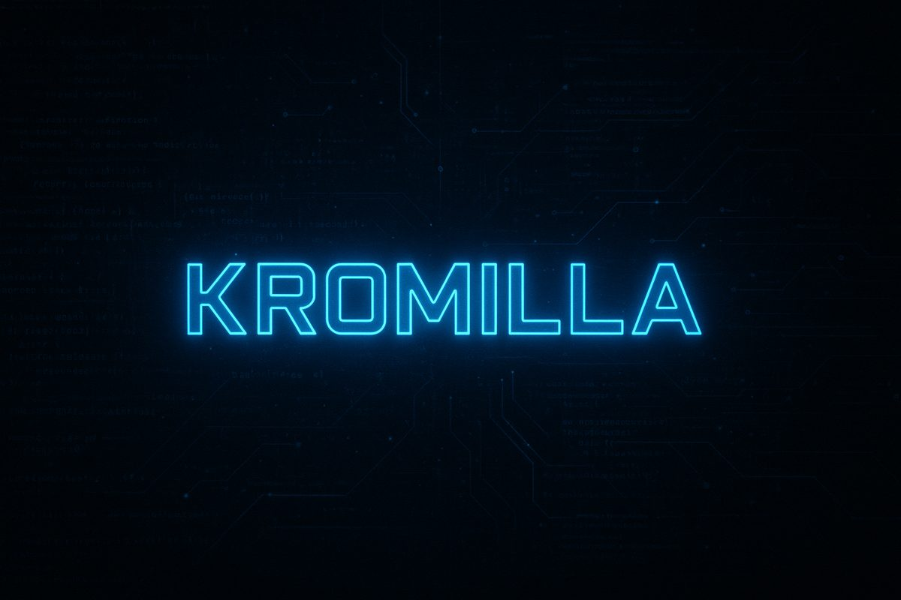

<div align="center">

# 💫 Carlos Alfredo Ibañez Ortiz

### Founder @ Kromilla Labs | Backend Developer | AI Bot Specialist

> **Building scalable systems and intelligent bots that drive efficiency.**

[](https://git.io/typing-svg)



<div align="center">
  <a href="https://kromilla-labs.vercel.app">
    
  </a>
  <a href="https://www.instagram.com/kromilla_labs/">
    
  </a>
  <a href="mailto:carlos15.ci15@gmail.com">
    
  </a>
  <a href="https://github.com/Kromilla">
    
  </a>
  <a href="https://www.linkedin.com/in/carlos-ibañez-a476b4265">
    
  </a>
  <a href="https://t.me/Kromilla">
    
  </a>
</div>

</div>

---
<br />

## 👨‍💻 Engineering Profile

```typescript
const carlos = {
  role: "Founder @ Kromilla Labs & Backend Engineer",
  location: "🇨🇴 Colombia",
  enterprise: "https://kromilla-labs.vercel.app",
  core_competencies: [
    "Production AI Agent Systems", 
    "Event-Driven Automation", 
    "High-Performance Backends"
  ],
  current_focus: "Deploying single-task autonomous agents for businesses",
  daily_drivers: ["Node.js", "Python", "TypeScript", "FastAPI", "Docker"],
  mission: "To automate the mundane and engineer the extraordinary."
};
```

---
<br />

### 🎯 Core Services

- 🏢 **Autonomous AI Agents**
  - Production agents for appointment booking, lead qualification and data extraction
- 🏗️ **Backend Architecture**
  - Building robust and scalable server-side systems with PostgreSQL, FastAPI & Node.js
- 🤖 **Multi-Platform Bot Development**
  - Creating intelligent bots (WhatsApp, Telegram, Discord) with enterprise integrations
- ⚙️ **Process Automation & Data Pipelines**
  - Real-time data collection, ETL pipelines and workflow optimization
- 📊 **Scientific & Statistical Computing**
  - High-performance in-browser analytical engines with WebAssembly (DuckDB-WASM)

---
<br />

## 🛠️ Technical Arsenal

<div align="center">

| **Core Stack** | **Infrastructure & Tools** | **Integrations** |
| :---: | :---: | :---: |
|   |   |   |
|   |   |   |
|   |  |  |

</div>

---
<br />

## 🚀 Proven Impact (Featured Work)

<table>
<tr>
  <td width="50%" valign="top">
    <h3 align="center">🏢 <a href="https://kromilla-labs.vercel.app">Kromilla Labs</a></h3>
    <p align="center"><strong>Production AI Agents Studio</strong></p>
    <p>
      Autonomous single-task AI agents that confirm appointments, qualify leads and structure operational records for clinics, real estate, and legal firms.
      <br />
      ✅ <strong>Single-Task Agents</strong>: Context-aware conversational flows with direct CRM data extraction.
      <br />
      ✅ <strong>Enterprise Architecture</strong>: Serverless API, multi-channel alerts (Telegram/Discord) and zero data retention training.
    </p>
    <p align="center">
      <a href="https://kromilla-labs.vercel.app">
        
      </a>
      
    </p>
  </td>
  <td width="50%" valign="top">
    <h3 align="center">🌤️ <a href="https://github.com/Kromilla/clima-plataforma">Clima Plataforma</a></h3>
    <p align="center"><strong>Environmental & Air Quality Intelligence</strong></p>
    <p>
      Multi-stream environmental monitor for Santa Marta, Colombia integrating satellite and weather telemetry.
      <br />
      ✅ <strong>Open-Data Pipeline</strong>: NASA FIRMS (wildfires), XM (energy) and Open-Meteo integration.
      <br />
      ✅ <strong>Full-Stack Alerting</strong>: High-speed FastAPI backend + React Dashboard + Telegram notification bot.
    </p>
    <p align="center">
      <a href="https://github.com/Kromilla/clima-plataforma">
        
      </a>
    </p>
  </td>
</tr>
<tr>
  <td width="50%" valign="top">
    <h3 align="center">🌍 <a href="https://github.com/Kromilla/sismos-global">Sismos Global</a></h3>
    <p align="center"><strong>In-Browser Probabilistic Seismology</strong></p>
    <p>
      Worldwide earthquake catalog, statistical analysis and probabilistic forecasting engine running entirely on client-side WebAssembly.
      <br />
      ✅ <strong>WASM Engine</strong>: DuckDB-WASM for lightning-fast queries across millions of seismic events.
      <br />
      ✅ <strong>Statistical Models</strong>: Gutenberg-Richter, Omori-Utsu, ETAS and PSHA implementations.
    </p>
    <p align="center">
      <a href="https://github.com/Kromilla/sismos-global">
        
      </a>
    </p>
  </td>
  <td width="50%" valign="top">
    <h3 align="center">🕹️ <a href="https://github.com/Kromilla/Discord-web-controller">Discord Command Center</a></h3>
    <p align="center"><strong>Real-time Bot Management Dashboard</strong></p>
    <p>
      Full-stack Next.js 14 application for seamless bot control and community moderation.
      <br />
      ✅ <strong>Live Control</strong>: WebSocket-powered interface for real-time bot status and control.
      <br />
      ✅ <strong>Modern UI</strong>: Glassmorphism design with Tailwind CSS and responsive layout.
    </p>
    <p align="center">
      <a href="https://github.com/Kromilla/Discord-web-controller">
        
      </a>
    </p>
  </td>
</tr>
</table>

---
<br />

## 📈 Activity & Automation

<div align="center">





<br />


<br />


</div>

### ⚡ Recent Activity
<!--START_SECTION:activity-->
- 🎉 Opened PR in [Kromilla/sismos-global](https://github.com/Kromilla/sismos-global)
- 💪 Pushed 1 commit to [Kromilla/Kromilla](https://github.com/Kromilla/Kromilla)
- 💪 Pushed 1 commit to [Kromilla/clima-plataforma](https://github.com/Kromilla/clima-plataforma)
<!--END_SECTION:activity-->

---
<br />

## 🤝 Collaborate

<div align="center">

**Ready to build something extraordinary?**

| **AI Agents & Bots** | **Backend Systems** | **Automation & Pipelines** |
| :---: | :---: | :---: |
| Single-Task Business Agents | High-performance APIs & DBs | Real-Time ETL & Telegram/Discord |

</div>

---

<sub>All systems operational. Crafted by <a href="https://github.com/Kromilla">Carlos Ibañez</a> — Founder @ <a href="https://kromilla-labs.vercel.app">Kromilla Labs</a>.</sub>
  <br />
  
</div>
